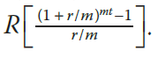
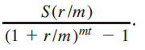

## Summary

Typically, everyone saves money periodically for retirement, buying a house, or for some other purposes. If you are saving money for retirement, then the money you put in a retirement fund is tax sheltered and your employer also makes some contribution into your retirement fund.

In this exercise, for simplicity, we assume that the money is put into an account that pays a fixed interest rate, and money is deposited into the account at the end of the specified period. Suppose that a person deposits `R` dollars’ `m` times a year into an account that pays `r %` interest compounded `m` times a year for `t` years. Then the total amount accumulated at the end of t years is given by  

For example, suppose that you deposit $500 at the end of each month into an account that pays 4.8% interest per year compounded monthly for 25 years. Then the total money accumulated into the account is  

_500[(1 + 0.048/12)&#179;&#8304;&#8304; - 1]/(0.048/12) = $289,022.42_.

On the other hand, suppose that you want to accumulate `S` dollars in `t` years and would like to know how much money, `m` times a year, you should deposit into an account that pays `r`% interest compounded m times a year. The periodic payment is given by the formula 
## Instructions

The `finance` header file has been provided. Use the above formulas to determine the total amount accumulated into an account and the periodic deposits to accumulate a specific amount. 

Your class should have instance variables to store the periodic deposit, the value of m, the interest rate, and the number of years the money will be saved. 

Add appropriate constructors to initialize instance variables, functions to set the values of the instance variables, functions to retrieve the values of the instance variables, and functions to do the necessary calculations and output results.  Also, write a program to test your `class`. 

> Since your program handles currency, make sure to use a data type that can store decimals with a decimal precision of 2.
