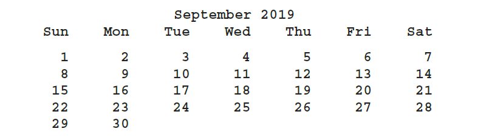

## Instructions
1. Write the definitions of the member functions of the `class calendarType` (designed in _Programming Exercise 9_) to implement the operations of the `class calendarType`.
1. Write a test program that accepts the number of a month (**1 - 12**) and the year from the user as input and prints the calendar for that particular month and year. For example, the calendar for September 2019 is:
 


An example of the program is shown below: 
```text
Enter 1 - 12 to indicate the calendar month to display: 
2
Enter the year: 
2019
                     February 2019
    Sun    Mon    Tue    Wed    Thu    Fri    Sat
                                         1      2
      3      4      5      6      7      8      9
     10     11     12     13     14     15     16
     17     18     19     20     21     22     23
     24     25     26     27     28
```