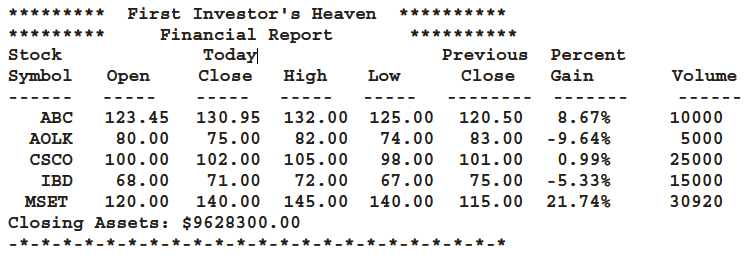

<!-- practice -->

## Summary

Write a program to help a local stock trading company automate its systems. The company invests only in the stock market. At the end of each trading day, the company would like to generate and post the listing of its stocks so that investors can see how their holdings performed that day. We assume that the company invests in, say, 10 different stocks. The desired output is to produce two listings, one sorted by stock symbol and another sorted by percent gain from highest to lowest.

The input data is provided in a file in the following format:

**symbol openingPrice closingPrice todayHigh todayLow prevClose volume**

For example, the sample data is:

**MSMT 112.50 115.75 116.50 111.75 113.50 6723823**

**CBA 67.50 75.50 78.75 67.50 65.75 378233**

**.**

**.**

**.**

The first line indicates that the stock symbol is **MSMT**, today’s opening price was **112.50**, the closing price was **115.75**, today’s high price was **116.50**, today’s low price was **111.75**, yesterday’s closing price was **113.50**, and the number of shares currently being held is **6723823**.

The listing sorted by stock symbols must be of the following form:

Develop this programming exercise in two steps. In the first step (part 1), design and implement a stock object. In the second step (part 2), design and implement an object to maintain a list of stocks.
