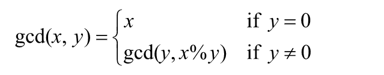

## Instructions ##
Given two integers *x* and *y*, the following recursive definition determines the greatest common divisor of *x* and *y*, written *gcd(x,y)*:

*Note*: In this definition, `%` is the mod operator.

Write a recursive function, `gcd`, that takes as parameters two integers and returns the greatest common divisor of the numbers.

Also, write a program to test your function.

