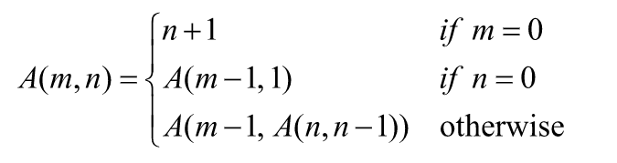

## Instructions ##
The Ackermann’s function is defined as follows:



in which `m` and `n` are nonnegative integers. Write a recursive function to implement Ackermann’s function. Also write a program to test your function with the following value pairs: 

m | n
---|---
0 | 0
0 | 1
1 | 1
3 | 2

An example of the program is shown below: 
```text
Ackermann(3,3): 61
Ackermann(3,4): 125
```

