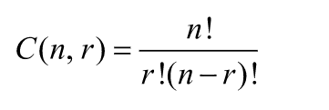

## Instructions ##
Write a recursive function to implement the recursive algorithm of *Exercise 18* (determining the number of ways to select a set of things from a given set of things). Also, write a program to test your function. The instructions from *Exercise 18* have been included below for your convenience: 

## Exercise 18 ##
Consider the following problem: How many ways can a committee of four people be selected from a group of 10 people? There are many other similar problems, where you are asked to find the number of ways to select a set of items from a given set of items. The general problem can be stated as follows: Find the number of ways *r* different things can be chosen from a set of *n* items, where *r* and *n* are nonnegative integers and *r &#8804; n*. Suppose C(n, r) denotes the number of ways *r* different things can be chosen from a set of *n* items. Then C(n, r) is given by the following formula:

where the exclamation point denotes the factorial function. Moreover, C(n, 0) = C(n, n) = 1. It is also known that C(n, r) = C(n - 1, r - 1) + C(n-1, r). 

1. Write a recursive algorithm to determine C(n, r). Identify the base case(s) and the general case(s).
2. Using your recursive algorithm, determine C(5, 3) and C(9, 4).

