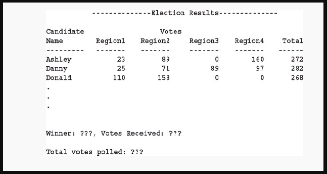

## Instructions ##
Redo the *Election Results Programming Example* (in this chapter) so that the names of the candidates and the total votes are stored in `vector` objects. **Programming Example: Election Results** has been included below for your convenience. 

## Programming Example: Election Results ##
The presidential election for the student council of your local university will be held soon. For reasons related to confidentiality, the chair of the election committee wants to computerize the voting. The chair is looking for someone to write a program to analyze the data and report the winner. Let us write a program to help the election committee.

The university has four major divisions, and each division has several departments. For the purpose of the election, the divisions are labeled as Region 1, Region 2, Region 3, and Region 4. Each department in each division manages its own voting process and directly reports the results to the election committee. The voting is reported in the following form:

     candidateName regionNumber numberOfVotesForTheCandidate

The election committee wants the output in the following tabular form:

The names of the candidates in the output must be in alphabetical order.

The data is provided in two files. One file, **candData.txt**, consists of the names of candidates. The names in the file are in no particular order. In the second file, **voteData.txt**, each line consists of voting results in the following form:
     candidateName regionNumber numberOfVotesForTheCandidate
