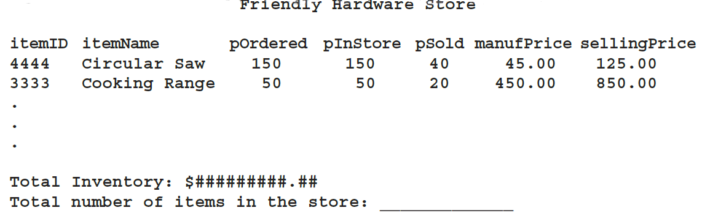

## Instructions ##
Write a program to keep track of a hardware store inventory. The store sells various items. For each item in the store, the following information is kept: **item ID**, **item name**, **number of pieces ordered**, **number of pieces currently in the store**, **number of pieces sold**, **manufacturer’s price for the item**, and the **store’s selling price**. At the end of each week, the store manager would like to see a report in the following form:

The total inventory is the total selling value of all of the items currently in the store. The total number of items is the sum of the number of pieces of all of the items in the store.

Your program must be menu driven, giving the user various choices, such as checking whether an item is in the store, selling an item, and printing the report. After inputting the data, sort it according to the items’ names. Also, after an item is sold, update the appropriate counts.

Initially, the number of pieces (of an item) in the store is the same as the number of pieces ordered, and the number of pieces of an item sold is zero. Input to the program is a file consisting of data in the following form:

     itemID
     itemName
     pOrdered manufPrice sellingPrice

Use seven parallel `vector` objects to store the information. The program must contain at least the following functions: one to input data into the vectors, one to display the menu, one to sell an item, and one to print the report for the manager.