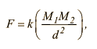

## Summary
Newton’s law states that the force, *F*, between two bodies of masses *M1* and *M2* is given by:

in which *k* is the gravitational constant and *d* is the distance between the bodies. The value of *k* is approximately *6.67 X 10-8 dyn. cm&#178;/g&#178;* . 

## Instructions
Write a program that prompts the user to input:
1. The masses of the two bodies.
2. The distance between the two bodies. 

The program then outputs:
1. The force between the bodies.

> Your program should be able to work with decimals. 
