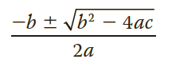

## Summary

The roots of the quadratic equation *ax&#178; + bx + c = 0*, *a &#8800; 0* are given by the following formula:

In this formula, the term *b&#178; - 4ac* is called the **discriminant**. If *b&#178; - 4ac = 0*, then the equation has a single (repeated) root. If *b&#178; - 4ac > 0*, the equation has two real roots. If *b&#178; - 4ac < 0*, the equation has two complex roots. 

## Instructions

Write a program that prompts the user to input the value of:
* *a* (the coefficient of *x&#178;*)
* *b* (the coefficient of *x*)
* *c* (the constant term)

The program then outputs the type of roots of the equation. 

Furthermore, if *b&#178; - 4ac &#8805; 0*, the program should output the roots of the quadratic equation. 

(Hint: Use the function `pow` from the header file `cmath` to calculate the square root. Chapter 3 explains how the function `pow` is used.)

>Format your output with a decimal precision of 2. 
