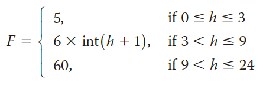

## Instructions
The short-term, 0-24 hours, parking fee, F, at an international airport is given by the following formula:

where *int(h + 1)* is the integer value of *h + 1*. For example, *int(3.2) = 3*, *int(4.8) = 4*. 

Write a program that prompts the user to enter the number of hours a car is parked at the airport and outputs the parking fee.

