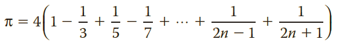

## Instructions
The value of *π* can be approximated by using the following series:

The program in *main.cpp* uses this series to find the approximate value of *π*. However, the statements are in the incorrect order, and there is also a bug in this program. 

Rearrange the statements and remove the bug so that this program can be used to approximate *π*.

