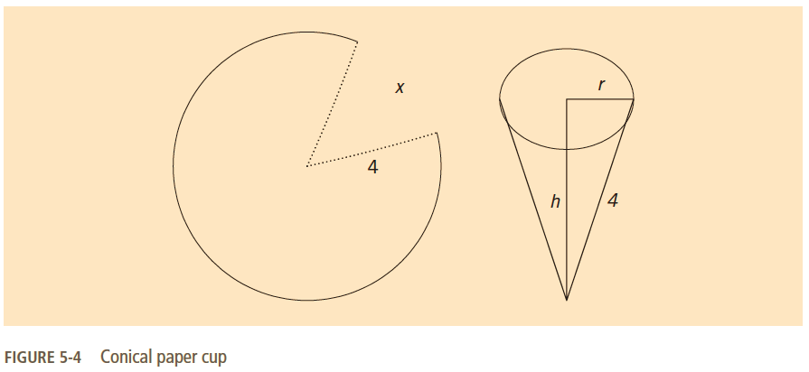

## Summary
(**The conical paper cup problem**) You have been given the contract for making little conical cups that come with bottled water. 

These cups are to be made from a circular waxed paper of 4 inches in radius by removing a sector of length x (see Figure 5-4 below). By closing the remaining part of the circle, a conical cup is made. 

Your objective is to remove the sector so that the cup is of maximum volume.

## Instructions
Write a program that prompts the user to enter the radius of the circular waxed paper. 

The program should then output:
1. The length of the removed sector so that the resulting cup is of maximum volume
2. The maximum volume

Calculate your answer to two decimal places.  
Use `3.141592654` for **PI**

> Format your output with `setprecision(2)` to ensure the proper number of decimals for testing!

