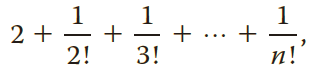

## Instructions
*Exercise 30 (Chapter 5)* defines the number *e*. The value of *e* can be approximated using the following expression:

where *n* is a positive integer. 

Write a program that prompts the user for the value of *n*.

The program then uses the formula above to approximate the value of *e*. 

Test your program for *n* = **4**, **8**, **10**, and **12**. 

>Format your output with `setprecision(15)` to ensure the proper number of decimals for testing!

