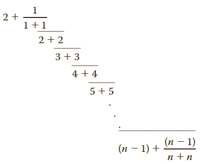

## Instructions
*Exercise 30 (Chapter 5)* defines the number *e* and *Exercise 31 (Chapter 5)* shows how to approximate the value of *e* using a different expression. 

Interestingly, the value of *e* can also be approximated using the following expression:

Write a program that uses this formula to approximate the value of *e*.

The program should prompt the user to input a value for *n* and then output the approximate value of *e*. Use `setprecision(15)` to format the output for the tests.

Test your program for *n* = **3**, **5**, **10**, **50**, and **100**.

