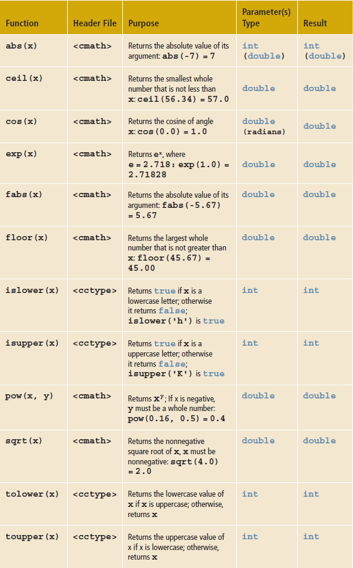

## Instructions
Write a program that defines the named constant `PI`, `const double PI = 3.14159;`, which stores the value of π. The program should use `PI` and the functions listed in _Table 6-1_ to accomplish the following:
* Output the value of √π .
* Prompt the user to input the value of a `double` variable `r`, which stores the radius of a sphere. The program then outputs the following:
 * The value of  _4.0πr²_, which is the surface area of the sphere.
 * The value of  _(4.0/3.0)πr³_, which is the volume of the sphere.

You should format your output like the following example:

```
Surface area of the sphere: 4 * PI * 5.00 ^ 2 = 314.16
Volume of the sphere: 4 / 3 * PI * 5.00 ^ 3 = 523.60
```

> Your output must match the wording precisely to earn full credit. Format your output with `setprecision(2)` to ensure the proper number of decimals for testing!

*Table 6-1*




