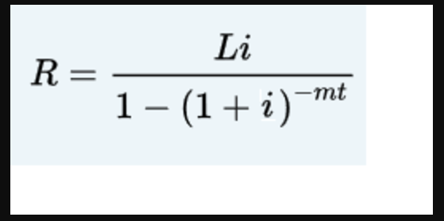
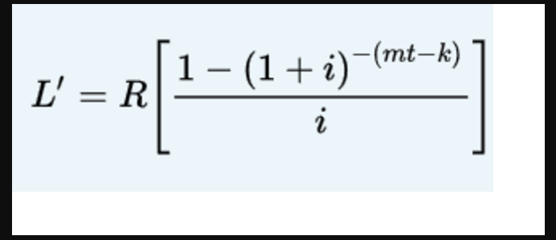

## Summary
When you borrow money to buy a house, a car, or for some other purposes, then you typically repay it by making periodic payments. Suppose that the loan amount is `L`, `r` is the interest rate per year, `m` is the number of payments in a year, and the loan is for `t` years. Suppose that `i = (r / m)` and `r` is in decimal. Then the periodic payment is: 



You can also calculate the unpaid loan balance after making certain payments. For example, the unpaid balance after making `k` payments is:  



where `R` is the periodic payment. (Note that if the payments are monthly, then `m = 12`.)
## Instructions

Write a program that prompts the user to input the values of `L, r, m, t, and k`. The program then outputs the appropriate values. Your program must contain at least two functions, with appropriate parameters, to calculate the periodic payments and the unpaid balance after certain payments. Make the program menu driven and use a loop so that the user can repeat the program for different values.

Example of expected output:
```
Enter (Y/y) to find the periodic payment and unpaid balance after certain payments: y

Enter the loan amount: 20000

Enter the interest rate per year as a percentage: 2.75

Enter the number of payments per year: 12

Enter the number of years for the loan: 30

The periodic payment is: 81.65
Enter the number of payments made: 20

The unpaid balance after 20 payment(s) is : 19267.89
Enter (Y/y) to find the periodic payment and unpaid balance after certain payments: n
```

> Format your output with `setprecision(2)` to ensure the proper number of decimals for testing!