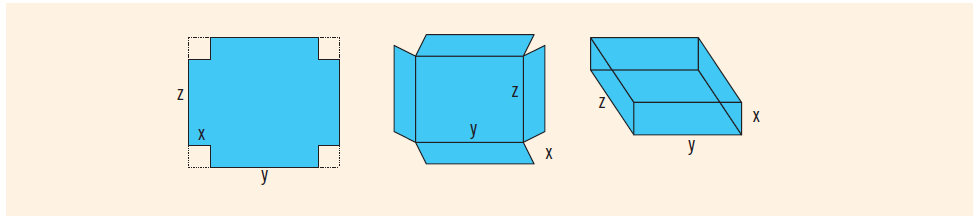

## Instructions
**The box problem**| You have been given a flat cardboard of area, say, 70 square inches to make an open box by cutting a square from each corner and folding the sides (see *Figure 6-17* below).  

Your objective is to determine the dimensions, that is, the length and width, and the side of the square to be cut from the corners so that the resulting box is of maximum volume.
	  
Write a program that prompts the user to enter the area of the flat cardboard. The program then outputs the length and width of the cardboard and the length of the side of the square to be cut from the corner so that the resulting box is of maximum volume. Calculate your answer to three decimal places. 

Your program must contain a function that takes as input the length and width of the cardboard and returns the side of the square that should be cut to maximize the volume. The function also returns the maximum volume.
