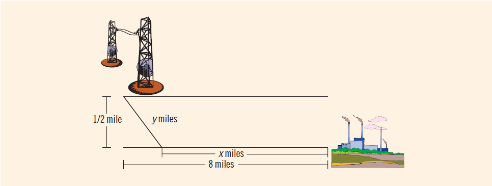

## Instructions
**The power station problem**| A power station is on one side of a river that is one-half mile wide, and a factory is 8 miles downstream on the other side of the river (see *Figure 6-18* below ). It costs $7 per foot to run power lines over land and $9 per foot to run them under water. 

Your objective is to determine the most economical path to lay the power line. That is, determine how long the power line should run under water and how long it should run over land to achieve the minimum total cost of laying the power line.

  
	
Write a program that prompts the user to enter the following:
* The width of the river
* The distance of the factory downstream on the other side of the river
* The cost of laying the power line under water
* The cost of laying the power line over land  

The program then outputs the length of the power line that should run under water and the length that should run over land so the cost of constructing the power line is at the minimum. The program should also output the total cost of constructing the power line.

