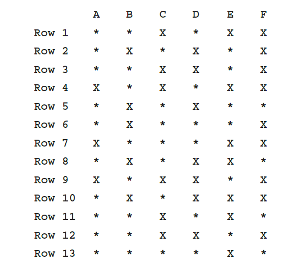

## Instructions
 **(Airplane Seating Assignment)** | Write a program that can be used to assign seats for a commercial airplane. The airplane has 13 rows, with six seats in each row. Rows 1 and 2 are first class, rows 3 through 7 are business class, and rows 8 through 13 are economy class. 
 
Use two parallel arrays: 
* a one-dimensional array to store the row number of the seats (**Row #**)
* a two-dimensional array of 13 rows and 6 columns to store the  seat assignments (**\***) and seat letters (**A-F**)

Your program must prompt the user to enter the following information:
* Reserve a seat (Yes (**Y/y**) or No (**N/n**))
* Assign ticket type (first class (**F/f**), business class (**B/b**), or economy class (**E/e**))
* Select desired seat (**1-13** and **A-F**)

Your program must contain at least the following functions:
* a function to initialize the seat plan.
* a function to show the seat assignments.
* a function to show the menu to assign a seat.
* a function to assign and select your desired seat.
* a function for each ticket type that determines if a seat is occupied and if that class is full .

Output the seating plan in the following form:

Here, **\*** indicates that the seat is available; **X** indicates that the seat is occupied. Make this a menu-driven program; show the user’s choices and allow the user to make the appropriate choices. 
